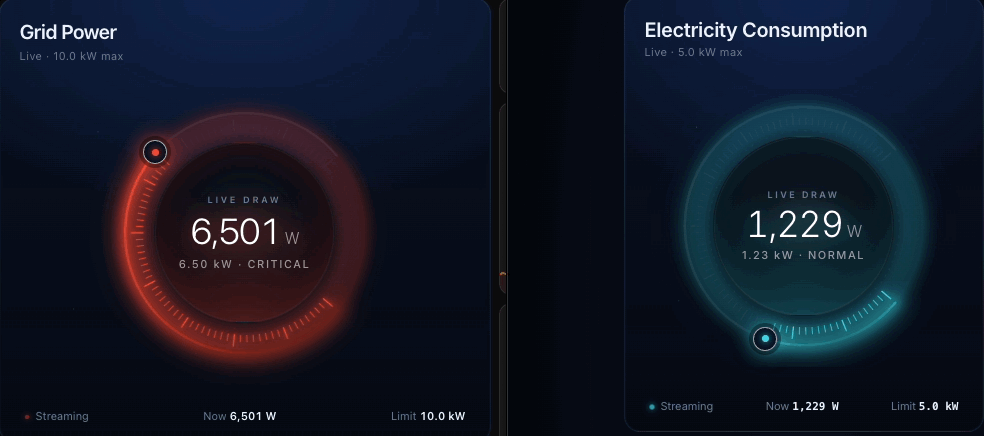

# Power Gauge Card

A glowing, smoothly-blending live-power gauge for [Home Assistant][ha] Lovelace dashboards.
The arc, the tick ring, the halo and the central readout all shift hue together as your load
climbs from cool blue, through orange, into deep red — exactly the way an electrical panel
*feels* when it goes from idle to peak.



One opinionated component. No theme to install, no helpers to plumb.
Drop it on any sensor that reports a number, give it three thresholds, and watch it breathe.

[](https://github.com/Lirum-Labs/ha-power-gauge/releases)
[](LICENSE)
[](https://www.home-assistant.io/)
[](https://www.jsdelivr.com/package/gh/Lirum-Labs/ha-power-gauge)

---

## What it does

- **Three configurable thresholds** — `normal`, `warning`, `critical` — each with its own colour. Below `normal` you get the cool colour; above `critical` you get the hot one. Set them in absolute power-draw values (e.g. watts), not percentages.
- **Smooth channel-wise colour blending.** Between any two thresholds the palette is interpolated continuously, so the gauge *transitions*, never *jumps*, as the load moves through the band.
- **Live-feel motion.** Animated tick ring (80 ticks light up sequentially), rotating outer aura, counter-rotating dashed inner ring, shimmering halo, pulsing "streaming" indicator.
- **Optional rolling-numbers flicker.** A subtle ±1.2 % drift on the displayed value. Toggle off (`rolling_numbers: false`) if you'd rather see exactly what the entity reports.
- **Visual editor.** Configure entity, range, thresholds, colours, precision and rolling-numbers behaviour from the dashboard's *Add Card → Edit* UI — no YAML required.
- **Robust to slow data.** Renders `—` with `WAITING FOR DATA` while the entity is missing / unavailable / unknown, then snaps to the real value the moment it arrives. No more "stuck at 0" while HA is still warming up.
- **Accessible.** Honours `prefers-reduced-motion`. All numbers in the lower readout are tabular-monospace so digit churn doesn't shove labels around.

## Install

### Option 1 — HACS (recommended)

1. **HACS → Frontend** → ⋮ menu → *Custom repositories*.
2. Add `https://github.com/Lirum-Labs/ha-power-gauge` with category **Lovelace**.
3. Install **Power Gauge Card**, then hard-refresh your browser (Cmd/Ctrl + Shift + R).

### Option 2 — Direct from JSDelivr (no install)

Skip HACS entirely. *Settings → Dashboards → Resources → Add Resource*:

```
URL:  https://cdn.jsdelivr.net/gh/Lirum-Labs/ha-power-gauge@v0.1.3/dist/ha-power-gauge.js
Type: JavaScript Module
```

Hard-refresh your browser. That's it — JSDelivr serves the bundle straight from this repo's tags.

### Option 3 — Manual / self-hosted

1. Download `dist/ha-power-gauge.js` from the [latest release](https://github.com/Lirum-Labs/ha-power-gauge/releases).
2. Drop it into `<config>/www/community/ha-power-gauge/`.
3. *Settings → Dashboards → Resources → Add Resource*:
   ```
   URL:  /local/community/ha-power-gauge/ha-power-gauge.js
   Type: JavaScript Module
   ```
4. Hard-refresh.

## Usage

Open a dashboard in edit mode, click **Add Card**, search for **Power Gauge Card**, and pick your sensor — or paste this into your YAML:

```yaml
type: custom:power-gauge-card
entity: sensor.grid_power_watts        # any sensor whose state is a number
name: Electricity Consumption          # optional override of friendly_name
unit: W                                # optional override of unit_of_measurement
min: 0
max: 10000                             # the gauge's upper bound
normal: 2000                           # blue at/below this draw
warning: 5000                          # orange at this draw
critical: 8000                         # red at/above this draw
rolling_numbers: false                 # see "Behaviour" below
```

### Tuning the thresholds for your panel

- **`max`** is what the gauge axis represents — set it to a value your panel will rarely exceed (e.g. 10 kW for a typical residential 200 A panel rarely peaking past that).
- **`normal`** is where the gauge should still be fully blue — your usual idle / baseline draw.
- **`warning`** is where you'd notice a heavy appliance running.
- **`critical`** is where you'd say "ok we're pushing it" — typically equal to or close to `max`.

Between any two thresholds the colour interpolates linearly across both the foreground arc and its derived shades, so the visual response feels smooth rather than stepped.

## Options

| Option            | Type    | Default                               | Description                                                                                                                                                                  |
| ----------------- | ------- | ------------------------------------- | ---------------------------------------------------------------------------------------------------------------------------------------------------------------------------- |
| `entity`          | string  | _(required)_                          | Any entity whose `state` is numeric.                                                                                                                                         |
| `name`            | string  | entity's `friendly_name`              | Title shown in the card header.                                                                                                                                              |
| `unit`            | string  | entity's `unit_of_measurement` or `W` | Unit shown next to the value.                                                                                                                                                |
| `min`             | number  | `0`                                   | Lower bound of the gauge axis.                                                                                                                                               |
| `max`             | number  | `5000`                                | Upper bound of the gauge axis.                                                                                                                                               |
| `precision`       | number  | `0`                                   | Decimal places to display.                                                                                                                                                   |
| `normal`          | number  | `min + 20% × (max − min)`             | Power draw at which the gauge is fully the *normal* colour.                                                                                                                  |
| `warning`         | number  | `min + 60% × (max − min)`             | Power draw at which the gauge is fully the *warning* colour.                                                                                                                 |
| `critical`        | number  | `max`                                 | Power draw at which the gauge is fully the *critical* colour.                                                                                                                |
| `normal_color`    | string  | `#1ee0ff` (cyan/blue)                 | Hex colour for the normal level.                                                                                                                                             |
| `warning_color`   | string  | `#ff7a2b` (orange)                    | Hex colour for the warning level.                                                                                                                                            |
| `critical_color`  | string  | `#ff1a3c` (red)                       | Hex colour for the critical level.                                                                                                                                           |
| `rolling_numbers` | boolean | `true`                                | When `true`, the displayed value continuously fluctuates ±1.2 % around the live value. When `false`, the value only changes on actual entity updates and ramps old → new.    |

## Behaviour

- **`rolling_numbers: true` (default)** — the gauge feels *alive*. A 2.6 s sine drift gently varies the displayed number ±1.2 % around the real value. Use this when you want the dashboard to look animated even when the underlying sensor only updates every few seconds.
- **`rolling_numbers: false`** — strictly truthful. The value sits exactly on what the entity reports, and when the entity changes, the number rolls smoothly from old to new over 700 ms (`easeOutCubic`) before settling. Best when accuracy matters more than ambience.
- **Loading / unavailable** — while `hass.states[entity]` is missing, `unavailable`, `unknown`, or non-numeric, the centre reads `—` with mood `WAITING FOR DATA` and the bottom pill says `Connecting`. The gauge snaps straight to the real value the instant it arrives — no animating up from `0`.
- **Reduced motion** — if the OS reports `prefers-reduced-motion: reduce`, the rotating aura, dashed ring, halo shimmer and pulse-dot animations are disabled. Colour-ramp animations for actual value changes are kept (they're informational, not decorative).

## Local development & preview

```bash
npm install
npm run build      # → dist/ha-power-gauge.js (ES module, for HA)
                   # → dist/ha-power-gauge.iife.js (classic script, for the dev page)
```

### Try it without Home Assistant

The repo ships a self-contained sandbox at [`dev/index.html`](dev/index.html) with sliders for value, thresholds, colours and the `rolling_numbers` toggle, plus an *Auto drift* button that simulates a fluctuating sensor.

```bash
npm run dev        # rollup --watch + static server on http://localhost:8000
# open http://localhost:8000/dev/
```

Or just open `dev/index.html` straight off disk in a browser — no server needed (the page loads a classic-script bundle so `file://` works).

## Contributing

Issues and pull requests welcome at <https://github.com/Lirum-Labs/ha-power-gauge>. Conventional Commits is used for messages. Run `npm run build` before opening a PR — the committed `dist/` is what JSDelivr serves and what HA loads.

## License

Apache License 2.0 — see [LICENSE](LICENSE).

This is a permissive licence: you can use, modify, embed and redistribute the card in commercial or non-commercial work. **In return, we ask you to keep credit visible.** If you fork this card, vendor it, or build a derivative product on top of it, Section 4(d) of the licence requires you to preserve the [NOTICE](NOTICE) file's attribution in your derivative's NOTICE / docs / credits surface. A line like

> Includes Power Gauge Card by Lirum Labs (https://github.com/Lirum-Labs/ha-power-gauge)

is enough.

## Credits

Built by **[Lirum Labs](https://github.com/Lirum-Labs)**. Inspired by the wonderful [Mushroom][mushroom] cards.

[ha]: https://www.home-assistant.io/
[mushroom]: https://github.com/piitaya/lovelace-mushroom
